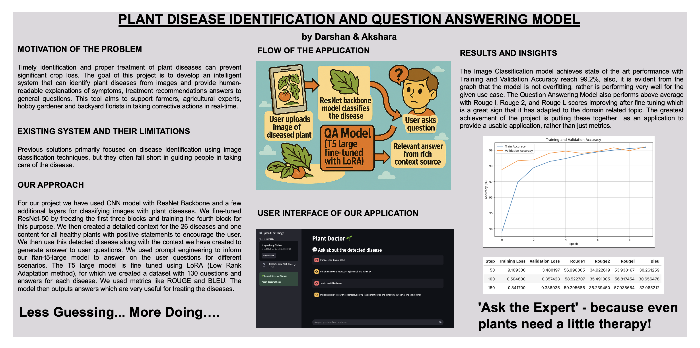

# Plant Disease Identification and QA System

## Motivation

Timely identification and treatment of plant diseases is **critical to preventing crop loss** and improving agricultural productivity. Most existing systems stop at **disease classification** — leaving users without actionable insights.

This project aims to solve that gap by not only classifying plant diseases from images, but also generating **natural language answers** to user questions using a **domain-specific fine-tuned language model**.

> “Less Guessing... More Doing.
> Ask the Expert – because even plants need a little therapy!”

## Watch our Video Walkthrough

YOUTUBE Link Here -> [YouTube Video](https://www.youtube.com/watch?v=2WJns_VitCA)

## Features

- Upload leaf image for disease prediction
- ResNet50-based image classifier trained on PlantVillage dataset
- Flan-T5 Large QA model fine-tuned using LoRA on 130+ domain-specific Q&A pairs
- Integrated chat interface to ask questions about symptoms, treatments, etc.
- Domain-tuned answers from curated disease contexts

## Poster



### Functional Pipeline


| Step | Component                       | Description                                        |
| ---- | ------------------------------- | -------------------------------------------------- |
| 1    | Image Upload                    | User uploads leaf image via UI                     |
| 2    | ResNet Classifier               | Predicts disease class with 99.2% accuracy         |
| 3    | User Question                   | User types a natural-language query                |
| 4    | QA Model (Flan-T5 Large + LoRA) | Generates context-rich answers using prompt tuning |
| 5    | Output                          | Returns an actionable answer to the user           |

## Our Approach

| Component            | Details                                                             |
| -------------------- | ------------------------------------------------------------------- |
| Image Classification | Fine-tuned**ResNet-50**, frozen first 3 blocks, trained final block |
| Context Curation     | Manual context generation for 26 plant diseases + 1 healthy case    |
| QA Dataset           | ~130 Q&A pairs collected per disease (symptoms, causes, treatment)  |
| Fine-tuning          | Used**LoRA** with Flan-T5-Large via HuggingFace `peft`              |
| Evaluation           | Metrics:**ROUGE-1**, **ROUGE-2**, **ROUGE-L**, **BLEU**             |
| Deployment           | Streamlit app, real-time interaction and inference                  |

## Results

### Classification

| Metric                  | Value                   |
| ----------------------- | ----------------------- |
| **Training Accuracy**   | 99.5%                   |
| **Validation Accuracy** | 99.2%                   |
| **Overfitting**         | No overfitting observed |

### QA Model (Flan-T5-Large + LoRA)

| Metric      | Before Fine-Tune | After Fine-Tune |
| ----------- | ---------------- | --------------- |
| **ROUGE-1** | ~22.4            | **59.29**       |
| **ROUGE-2** | ~11.3            | **36.23**       |
| **ROUGE-L** | ~20.7            | **57.93**       |
| **BLEU**    | ~14.0            | **32.06**       |

** Insight:** After fine-tuning, the model adapts significantly to domain-specific phrasing, symptoms, and treatments — yielding more relevant and fluent answers.

## Installation

```bash
git clone <your-repo-url>
cd <your-project-folder>

# Create environment
python3 -m venv venv
source venv/bin/activate

# Install dependencies
pip install -r requirements.txt

# Run Streamlit app
streamlit run app.py
```

## Requirements

See [`requirements.txt`](./requirements.txt) – includes:

```
streamlit
torch
torchvision
Pillow
transformers
peft
datasets
evaluate
numpy
```

## Credits

Built by **Darshan & Akshara**
CU Boulder – Deep Learning Course
